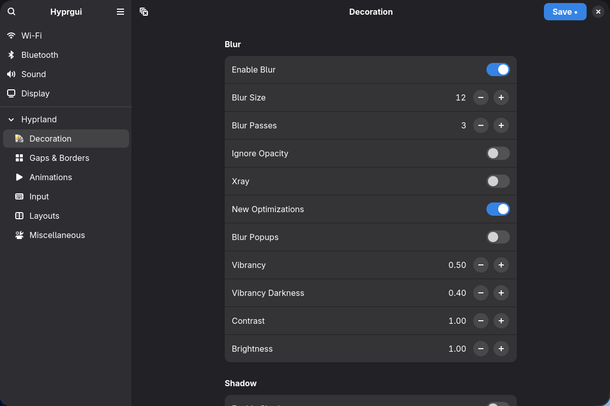

# Hyprgui

A GTK4 + libadwaita settings app for [Hyprland](https://hyprland.org/), written in Python with PyGObject.



## Features

- **Hyprland Settings** — 67 settings across Decoration, Gaps & Borders, Animations, Input, Layouts, and Miscellaneous with live preview
- **Wi-Fi** — Connect to and manage wireless networks (NetworkManager D-Bus)
- **Bluetooth** — Scan, pair, and connect Bluetooth devices (BlueZ D-Bus)
- **Sound** — Adjust volume and select audio devices (wpctl/pactl)
- **Display** — View monitor configuration (hyprctl monitors)

Changes apply instantly via `hyprctl keyword` and can be saved to `~/.config/hypr/hyprgui.conf`.

## Requirements

- Python 3.11+
- PyGObject
- GTK4
- libadwaita

Hyprland is needed for Hyprland settings and the Display page. Wi-Fi, Bluetooth, and Sound pages work independently.

## Running

```bash
python -m hyprgui
```

## Architecture

Hyprland settings are **registry-driven** — each setting is a `SettingDef` entry in `settings_registry.py`. The UI, live preview, and config persistence are all derived from this list. Adding a setting is a one-line change.

System pages (Wi-Fi, Bluetooth, Sound, Display) are `BasePage` subclasses with their own lifecycle, using D-Bus or subprocess backends.

## License

TBD
